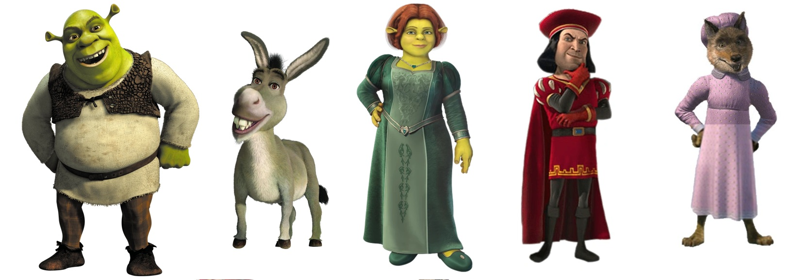

# Proyecto_Whatsapp_Victor_MCD

<a target="_blank" href="https://cookiecutter-data-science.drivendata.org/">
    
</a>

## 1. Introducción General al Proyecto
Este proyecto consiste en descargar, procesar y analizar los mensajes pertenecientes a un chat personal de un grupo de WhatsApp. La finalidad de este proyecto es el adquirir experiencia en la ingesta, limpieza y manipulación de cadenas de caracteteres. Este proyecto forma parte del curso de Ingeniería de Características de la Maestría en Ciencia de Datos de la Universidad de Sonora (MCD). 

A lo largo de este repositorio se abordan las siguientes etapas:
* **Ingesta y estructuración:** Parseo de líneas y captura de mensajes multilínea mediante expresiones regulares (RegEx) para extraer marcas temporales, remitentes y contenido textual (notebook 1.0)
* **Limpieza y transformación de datos:** Conversión de fechas a formato nativo `datetime64`, clasificación de cada tipo de mensaje (texto, notas de voz, stickers, multimedia o documentos) y anonimización de la identidad de los participantes (notebook 2.0). 
* **Análisis exploratorio de datos (EDA):** Identificación del volumen de participación, dinámica temporal (días más activos, curva horaria y mapas de calor semanales) y distribuciones de longitud de mensajes. En esta parte, se realizó el procesamiento del lenguaje natural para identificar palabras y adjetivos del chat de whatsapp. 

## Anonimización de personajes

Para mantener la privacidad de los usuarios del grupo, se anonimizaron los nombres de todos los usuarios. Se optó por cambiar el nombre de los usuarios por personajes de las películas de Shrek, seleccionando a los siguientes personajes: Shrek, Burro, Fiona, Lord Farquad, y Lobo de Sexo Dudoso.

<p align="center">
  
</p>

La anonimización consistió en cambiar el nombre del remitente de cada mensaje, así como las menciones hechas a cada usuario dentro del chat. 

## 2. Esquema de Trabajo: Cookiecutter Data Science (CCDS)
El repositorio fue organizado siguiendo el estándar canónico de **Cookiecutter Data Science (CCDS)**, cuyo objetivo es garantizar reproducibilidad, modularidad y separación limpia entre datos inmutables, código fuente y reportes:

```text
Proyecto-Whatsapp/
├── LICENSE            <- Open-source license if one is chosen
├── Makefile           <- Makefile with convenience commands like `make data` or `make train`
├── README.md          <- The top-level README for developers using this project.
├── data
│   ├── external       <- Data from third party sources.
│   ├── interim        <- Intermediate data that has been transformed.
│   ├── processed      <- The final, canonical data sets for modeling.
│   └── raw            <- The original, immutable data dump.
│
├── docs               <- A default mkdocs project; see www.mkdocs.org for details
│
├── models             <- Trained and serialized models, model predictions, or model summaries
│
├── notebooks          <- Jupyter notebooks. Naming convention is a number (for ordering),
│                         the creator's initials, and a short `-` delimited description, e.g.
│                         `1.0-jqp-initial-data-exploration`.
│
├── pyproject.toml     <- Project configuration file with package metadata for 
│                         Analisis_Historial_Whatsapp and configuration for tools like black
│
├── references         <- Data dictionaries, manuals, and all other explanatory materials.
│
├── reports            <- Generated analysis as HTML, PDF, LaTeX, etc.
│   └── figures        <- Generated graphics and figures to be used in reporting
│
├── requirements.txt   <- The requirements file for reproducing the analysis environment, e.g.
│                         generated with `pip freeze > requirements.txt`
│
├── setup.cfg          <- Configuration file for flake8
│
└── Analisis_Historial_Whatsapp   <- Source code for use in this project.
    │
    ├── __init__.py              <- Makes Analisis_Historial_Whatsapp a Python module
    │
    ├── config.py                <- Store useful variables and configuration
    │
    ├── dataset.py               <- Scripts to download or generate data
    │
    ├── features.py              <- Code to create features for modeling
    │
    ├── modeling                 
    │   ├── __init__.py 
    │   ├── predict.py           <- Code to run model inference with trained models          
    │   └── train.py             <- Code to train models
    │
    └── plots.py                 <- Code to create visualizations
```

## 3. Preguntas a responder en este trabajo:
* ¿Cuál es el usuario que más mensajes envía?
* ¿Cual es la frecuencia promedio de palabras por mensaje de texto de cada usuario?
* ¿Cuál es el usuario que más palabras envía? ¿Y el que envía más emojis? ¿Y el que envía más *stickers*?
* ¿Que días de la semana se mandan más mensajes y cuales menos? ¿Hay un patron semanal? ¿Y por hora del día?
* ¿Que palabras son las más usadas por cada usuario? ¿Y en general? ¿Que palabras son las más usadas en el grupo que no sean *stop words*? 
*¿Cuales son los adjetivos más usados?

## 4. Conclusiones
En este proyecto, aprendí a estructurar mi proyecto mediante CCDS, el cual me parecer que es fundamental para poder organizar un proyecto de ciencia de datos y facilitar las etapas de cada proyecto. Además, aprendí la importancia del parseo de datos mediante el uso de expresiones regulares, las cuales son esenciales para poder dar identificar y filtrar cadenas de caracteres en los mensajes. Por otra parte, aprendí de manera práctica sobre el procesamiento de lenguaje natural al combinar stop words personalizadas junto con herramientas de lematización con la finalidad de diferenciar palabras genéricas y adjetivos en el chat de WhatsApp.

Personalmente, me sorprendió la variación de los mensajes a lo largo de cada día de la semana. En este proyecto, se observó que el jueves es el día qué más mensajes se envían. De manera similar, me pareció interasante las horas a las que los usuarios son más activos en el chat. Se observó que las horas donde más se envían mensajes es entre las 18 y 20 horas. ¿Tendrá esto que ver con que es una hora a la que la mayoría de los miembros del grupo ya no está trabajando? ¿Será la hora donde las personas del grupo deciden usar tiempo de ocio?

Me gustaría realiar un análisis de sentimiento para evaluar la polaridad de los mensajes: positivos, negativos, etc. A su vez, me gustaría implementar algoritmos de modelado de temas para identificar cuáles son los temas principales de conversación del grupo.
